<p align="center">
  
</p>

<h1 align="center">FixBundle 🧰</h1>

<p align="center"><strong>Hatanın hikâyesini değil, kanıtını paketle.</strong></p>

<p align="center">
  <a href="https://github.com/yaertu/fixbundle/actions/workflows/ci.yml"></a>
  
  
  
  
  
</p>

<p align="center"></p>

Bir hata localde, eski bir commit'te veya GitHub Actions'ta yaşanmış olabilir. FixBundle failure output, exact Git identity, job/step bilgisi, diff/config bağlamı ve ilgili kaynak parçalarını toplar; yaygın secret/path kalıplarını maskeler; checksum'lı tek ZIP üretir. Aynı paketi Codex'e, Claude Code'a, Cursor'a, ChatGPT'ye veya insan destek ekibine verebilirsin.

## ⚡ Kurulum

PyPI yayını yapılana kadar:

```bash
pipx install git+https://github.com/yaertu/fixbundle.git
```

Local failure:

```bash
fixbundle . --lang tr --run "pytest -q" --run "python -m build"
```

Eski commit'teki failure:

```bash
fixbundle . --commit <commit-sha> --run "python app.py" --lang tr
```

GitHub Actions failure:

```bash
export GITHUB_TOKEN=<read-only-token>
fixbundle github --repo owner/repo --run <failed-run-id> --lang tr
```

Windows PowerShell:

```powershell
$env:GITHUB_TOKEN = "<read-only-token>"
fixbundle github --repo owner/repo --run <failed-run-id> --lang tr
```

GitHub token için mümkün olan en dar **Actions: Read + Contents: Read** yetkisini kullan. Token output'a serialize edilmez ve FixBundle ZIP'i kendiliğinden hiçbir yere yüklemez.

## 🎬 Gerçek kanıtlar

### Historical commit

<p align="center">
  
</p>

`python scripts/demo.py` eski commit'teki gerçek `AssertionError`'ı yakalar; current HEAD ve dirty workspace'in değişmediğini doğrular.

### GitHub Actions, canlı API

v0.4 yalnız fixture ile doğrulanmadı. FixBundle'ın kendi geliştirme geçmişindeki **gerçek failed CI run `33587184675`** tekrar okunarak portable bundle üretildi. O olayda üç Windows job'ı `Historical demo` step'inde `UnicodeEncodeError / cp1252` ile kırılmıştı.

GitHub Actions run **#63 / `33589138174`** üzerinde gerçek CLI çağrısı şu zinciri başarıyla tamamladı:

```text
PASS live_run=33587184675
PASS failed_jobs=3
PASS log_files=3
PASS failed_step=Historical demo
PASS real_failure=UnicodeEncodeError/cp1252
PASS checksums=9
PASS token_not_serialized
```

Aynı run'da **Ubuntu + Windows + macOS × Python 3.10 / 3.12 / 3.13 = 9/9** platform job'ı ve ayrı **Live GitHub failure evidence** job'ı geçti. Ayrıntı: [`docs/evidence/V04_LIVE_GITHUB.md`](docs/evidence/V04_LIVE_GITHUB.md).

## 📦 GitHub failure ZIP'i

```text
AI_HANDOFF.md
github/
  run.json             # repo / workflow / run / commit identity
  jobs.json            # job + step sonuçları
  jobs/<job-id>.log    # yalnız failed job logları, bounded + redacted
  commit.json          # ilgili commit + bounded patch context
  workflow.yml         # olay anındaki workflow config, erişilebiliyorsa
manifest.json
SHA256SUMS.txt
```

Remote capture local checkout gerektirmez. Yalnız `completed + failure` run kabul edilir.

## 🛡️ Privacy by default

- `.env`, `.npmrc`, `.pypirc` ve bilinen secret dosyaları local capture'da varsayılan olarak dışlanır.
- API key, bearer token, GitHub/OpenAI/Google/AWS token kalıpları, JWT, private key ve URL credential kalıpları maskelenir.
- Local project/home path'leri anonimleştirilir.
- Text, diff ve log capture'ları boyut sınırıyla tutulur.
- GitHub job-log redirect'lerinde bearer token imzalı blob URL'ye taşınmaz.
- Otomatik cloud upload yoktur.

Redaction kusursuzluk garantisi değildir. Hassas veya proprietary bir bundle'ı public paylaşmadan önce ZIP'i kontrol et.

## 🧩 FixBundle neyin yerine geçmiyor?

| Araç / yaklaşım | Ana iş |
|---|---|
| **Repomix** | repository'yi LLM-friendly code context'e paketlamak |
| **temporal-debug-skill** | agent'a historical worktree akışı öğretmek |
| **GitHub Actions + Copilot** | GitHub içindeki failed check/log'u açıklamak |
| **Sentry / observability AI** | kendi telemetry backend'i içinde runtime teşhisi yapmak |
| **FixBundle** | **failure evidence'i agent/vendor bağımsız, redacted ve checksum'lı pakete çevirmek** |

Ürün sınırı: **portable failure evidence**. Ayrıntı: [`docs/product/LANDSCAPE.md`](docs/product/LANDSCAPE.md).

## 🧩 Stack algılama

| Yığın | Kanıt örneği | Öneri örneği |
|---|---|---|
| 🟨 Node.js | `package.json` | `npm test`, `npm run build` |
| 🐍 Python | `pyproject.toml`, `requirements.txt` | `pytest -q`, `python -m build` |
| 🦀 Rust | `Cargo.toml` | `cargo test`, `cargo build --release` |
| 🟪 .NET | `.sln`, `.csproj` | `dotnet test`, `dotnet build -c Release` |
| 🐹 Go | `go.mod` | `go test ./...`, `go build ./...` |
| ☕ Java | `pom.xml`, Gradle | `mvn test`, package/build |

```bash
fixbundle . --recommend --lang tr
```

## 🌍 English quick summary

**Package local failures, historical Git bugs, and failed GitHub Actions runs into redacted, portable evidence bundles.** FixBundle captures exact incident identity, bounded logs/diffs/config context and produces checksummed evidence that can move between AI coding tools and human support.

```bash
fixbundle . --run "npm test"
fixbundle . --commit <incident-sha> --run "npm test"
fixbundle github --repo owner/repo --run <failed-run-id>
```

## 🗺️ Yol haritası

- **v0.3 ✅ Temporal Evidence:** historical commit/worktree capture.
- **v0.4 ✅ GitHub Native:** gerçek failed Actions run → portable evidence ZIP.
- **v0.5 Production Evidence Import:** vendor-neutral OTLP JSONL önce; Sentry adapter yalnız ek değer sağladığı yerde.
- **v0.6 Regression Fingerprints:** bundle-vs-bundle failure/environment/dependency drift.
- **v1.0 Stable Evidence Protocol:** versioned schema + plugin SDK + signed manifest option.

Sıradaki kararın araştırma temeli: [`docs/product/V05_PRODUCTION_EVIDENCE.md`](docs/product/V05_PRODUCTION_EVIDENCE.md).

## 🤝 Proje notları

- Katkı: [`CONTRIBUTING.md`](CONTRIBUTING.md)
- Güvenlik: [`SECURITY.md`](SECURITY.md)
- Canlı v0.4 kanıtı: [`docs/evidence/V04_LIVE_GITHUB.md`](docs/evidence/V04_LIVE_GITHUB.md)
- Rakip/komşu araçlar: [`docs/product/LANDSCAPE.md`](docs/product/LANDSCAPE.md)
- Launch planı: [`docs/product/LAUNCH_PLAYBOOK.md`](docs/product/LAUNCH_PLAYBOOK.md)
- Gelir yaklaşımı: [`docs/product/MONETIZATION.md`](docs/product/MONETIZATION.md)
- Adoption baseline: [`docs/product/METRICS.md`](docs/product/METRICS.md)
- Repo bakım protokolü: [`AGENTS.md`](AGENTS.md)

## 🔎 GitHub About / Topics

v0.4 sonrası önerilen About açıklaması:

> Package local failures, historical Git bugs, and failed GitHub Actions runs into redacted AI-ready evidence bundles.

Önerilen topics mevcut 15 topic'e ek olarak `github-actions` içerir. Kaynak: [`docs/product/REPO_HOME.md`](docs/product/REPO_HOME.md).

## 📜 Lisans

MIT.
