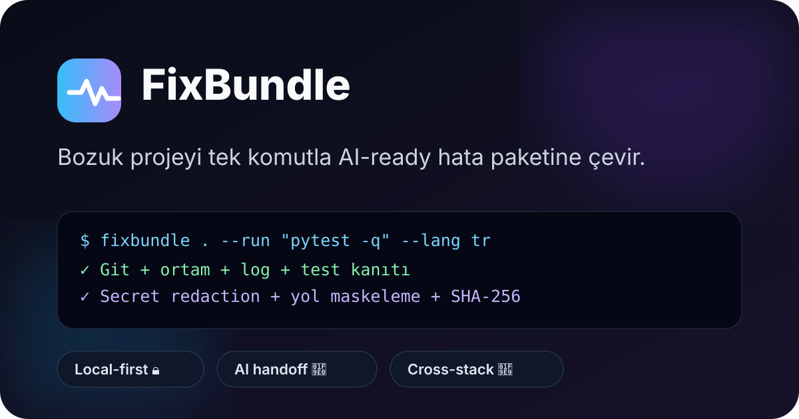
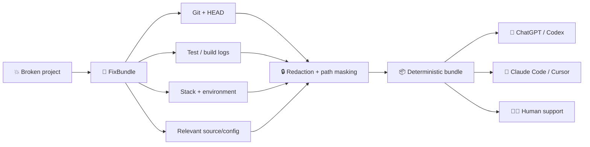
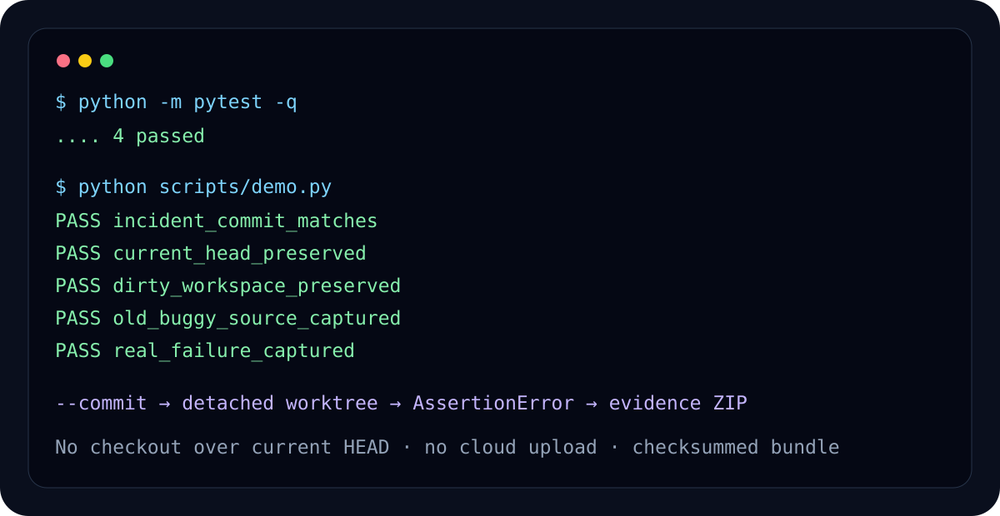

<p align="center">
  
</p>

<h1 align="center">FixBundle 🧰</h1>

<p align="center"><strong>Bozuk projeyi tek komutla AI-ready hata ayıklama paketine çevir.</strong></p>

<p align="center">
  <a href="https://github.com/yaertu/fixbundle/actions/workflows/ci.yml"></a>
  
  
  
  
</p>

<p align="center"></p>

> **Sonuç:** Ekran görüntüsü, yarım log ve rastgele kaynak dosyası taşımak yerine tek ZIP üret. ChatGPT, Codex, Claude Code, Cursor veya insan destek ekibi aynı kanıt seti üzerinden çalışsın.

## ⚡ 30 saniyelik kullanım

```bash
pipx install fixbundle
cd bozuk-proje
fixbundle . --lang tr --run "pytest -q" --run "python -m build"
```

Önce hangi komutların mantıklı olduğunu görmek istersen:

```bash
fixbundle . --recommend --lang tr
```

Çıktı:

```text
.fixbundle/
└── fixbundle-proje-YYYYMMDD-HHMMSS.zip
```

ZIP'in içinde:

```text
AI_HANDOFF.md          # AI için kanıt önceliği + istenen cevap formatı
manifest.json          # capture manifesti ve privacy bilgisi
stack.json             # algılanan teknoloji yığınları + önerilen komutlar
system.json            # işletim sistemi/runtime kanıtı
tree.txt               # filtrelenmiş proje ağacı
SHA256SUMS.txt         # bütünlük doğrulaması
git/
  head.txt             # olayın ilişkilendirileceği commit
  branch.txt
  status.txt
  diff.patch
  recent.txt
commands/
  01.log               # gerçek test/build çıktıları
project/
  ...                  # seçilmiş text/source/config snapshotları
```

## 🎯 Neyi çözüyor?

AI coding araçları çoğu zaman **kanıt eksikliğinden** hata yapıyor: yanlış commit, eksik log, bilinmeyen ortam, devasa ve ilgisiz source dump'ı veya chat'e yanlışlıkla taşınmış secret'lar. FixBundle bu dağınıklığı standart bir diagnostic handoff'a dönüştürür.



## 🛡️ Privacy by default

FixBundle v0.2.0:

- `.env`, `.npmrc`, `.pypirc`, credential/secrets dosyalarını varsayılan olarak **almaz**.
- API key, bearer token, GitHub token, OpenAI key, Google key, AWS access key, JWT, private key ve URL credential kalıplarını **maskeler**.
- Proje kökü ve kullanıcı home yolunu `<PROJECT>` / `<HOME>` olarak **anonimleştirir**.
- `node_modules`, `.git`, `target`, `dist`, `build`, `.fixbundle` gibi üretilmiş/vendor klasörlerini **dışlar**.
- Tek text capture'ı sınırlayarak runaway log/diff şişmesini **engeller**.
- Hiçbir şeyi buluta yüklemez. **Local-first** çalışır.

Hiçbir redactor kusursuz değildir. Özellikle proprietary repository'lerde paylaşmadan önce ZIP'i gözden geçir.

## 🧩 Stack algılama

| Yığın | Kanıt örneği | Öneri örneği |
|---|---|---|
| 🟨 Node.js | `package.json` | `npm test`, `npm run build` |
| 🐍 Python | `pyproject.toml`, `requirements.txt` | `pytest -q`, `python -m build` |
| 🦀 Rust | `Cargo.toml` | `cargo test`, `cargo build --release` |
| 🟪 .NET | `.sln`, `.csproj` | `dotnet test`, `dotnet build -c Release` |
| 🐹 Go | `go.mod` | `go test ./...`, `go build ./...` |
| ☕ Java | `pom.xml`, Gradle | `mvn test`, package/build |

FixBundle öneri verir, fakat v0.2'de önerilen komutları kullanıcı izni olmadan otomatik çalıştırmaz.

## 🧪 Çalıştığına dair kanıt

<p align="center"></p>

Yerel v0.2 doğrulamasında **3/3 test geçti**, FixBundle kendi repository'sini capture edip test çıktısını bundle'a ekledi ve redaction/path masking uyguladı. Yeniden üretilebilir komutlar için [SMOKE_TEST.md](docs/evidence/SMOKE_TEST.md) dosyasına bak.

## 🌍 English quick summary

**One command turns a broken project into an AI-ready debugging bundle.** FixBundle captures Git state, exact commit identity, command failures, stack/environment evidence and relevant source/config snapshots; then redacts common secrets and absolute user paths before producing a checksum-verified ZIP. Local-first, no cloud account required.

```bash
fixbundle . --run "npm test" --run "npm run build"
```

## 🗺️ Yol haritası

- **v0.2 ✅** Stack detection, Git HEAD evidence, Turkish CLI, stronger redaction/path masking.
- **v0.3** Historical snapshot/worktree capture for production bugs that happened on an older commit.
- **v0.4** GitHub Actions failure bundle + issue handoff.
- **v0.5** Sentry/structured log adapters + time-window capture.
- **v0.6** Before/after regression fingerprints + environment drift.
- **v1.0** Stable bundle schema + plugin SDK + signed manifests.

Detay: [ROADMAP.md](ROADMAP.md)

## 🤝 Katkı

Bug raporunda mümkünse **FixBundle ile üretilmiş, kontrol edilmiş** kanıt ekle. Özellikle secret içerebilecek proprietary içerikleri public issue'ya yükleme. Katkı akışı: [CONTRIBUTING.md](CONTRIBUTING.md).

## 🔎 GitHub topic önerileri

Repository **About → Topics** alanına şunları ekle:

`ai-debugging` · `developer-tools` · `diagnostics` · `bug-report` · `support-bundle` · `codex` · `claude-code` · `cursor` · `reproducibility` · `python`

## 📜 Lisans

MIT. Güvenlik bildirimi: [SECURITY.md](SECURITY.md).
